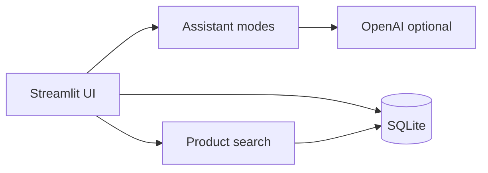

# Nuvexa AI

Nuvexa is a Streamlit prototype that combines a multi-mode OpenAI assistant with local conversation history and a simulated shopping cart and checkout workflow.

## Portfolio focus

The project demonstrates UI state management, prompt-mode switching, safe optional AI configuration, SQLite persistence, product search, and a complete local cart-to-order flow. Shopping results and checkout are simulations: Nuvexa does not scrape retailers, verify live prices, charge a payment method, or place external orders.

## Features

- Assistant, shopping, supportive-listening, and project-planning prompt modes
- Optional OpenAI chat with configurable model
- Persistent per-mode conversation history in SQLite
- Deterministic local product catalog and search
- Cart quantity management, simulated checkout, and order history
- Offline tests that require no API key

## Architecture



## Run locally

```bash
git clone https://github.com/Toddni8022/nuvexa-ai.git
cd nuvexa-ai
python -m venv .venv
source .venv/bin/activate  # Windows: .venv\Scripts\activate
pip install -r requirements.txt
cp .env.example .env
streamlit run app.py
```

The non-AI catalog, cart, checkout simulation, and order history work without an OpenAI key.

## Verification

```bash
pip install -r requirements-dev.txt
pytest -q
```

## Privacy and safety

- API keys are never displayed or logged.
- Conversations are stored locally in `nuvexa.db`; delete that file to remove local history.
- Supportive-listening mode is not therapy, diagnosis, crisis support, or medical advice.
- Product data is demonstration data and may be outdated.

## Repository hygiene

Generated executables, PyInstaller build output, ZIP bundles, backups, and duplicate source trees are intentionally excluded. Releases should be attached through GitHub Releases rather than committed to source control.

## License

MIT
